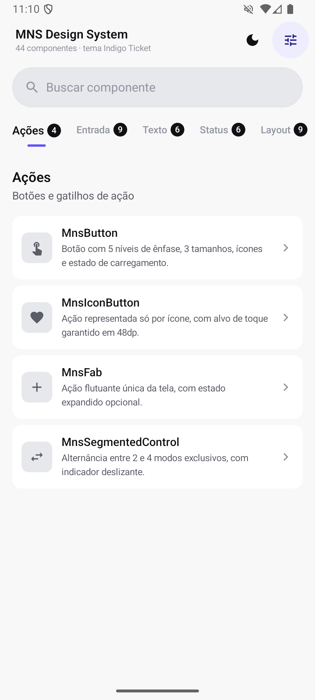
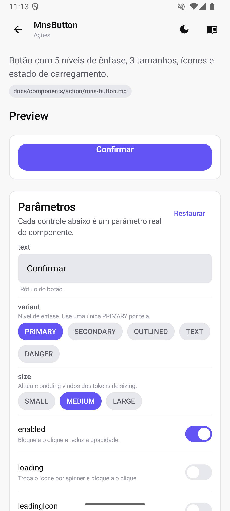
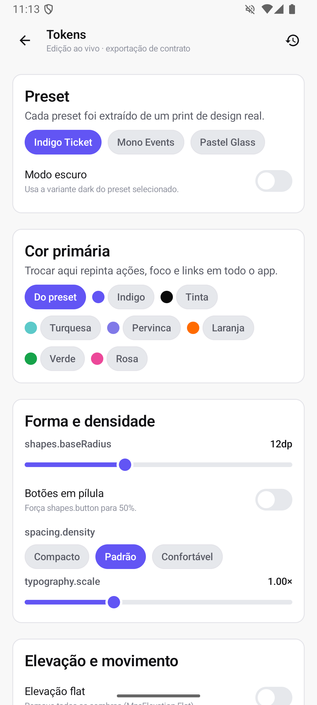
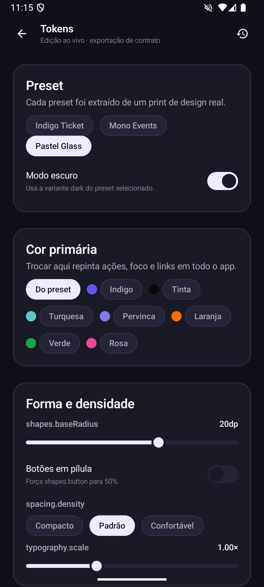

# MNS Design System

Design system Android em **Jetpack Compose** — 100% tokenizável, desacoplado e
publicado como artefato Maven.

[](https://github.com/matheusbrum11/mns-design-system/actions/workflows/ci.yml)
[](https://github.com/matheusbrum11/mns-design-system/actions/workflows/snapshot.yml)
[](https://github.com/matheusbrum11/mns-design-system/actions/workflows/release.yml)
[](docs/testing.md)
[](LICENSE)

```kotlin
implementation("io.github.matheusbrum11:mns-design-system:0.1.0")
```

```kotlin
MnsTheme(provider = MnsIndigoTicket) {
    MnsScaffold(topBar = { MnsTopBar(title = "Eventos") }) { padding ->
        MnsButton(text = "Comprar ingresso", onClick = ::comprar, fillMaxWidth = true)
    }
}
```

| Catálogo | Tela de componente | Playground de tokens | Modo escuro |
|---|---|---|---|
|  |  |  |  |

---

## O que tem aqui

- **45 componentes** em 10 categorias — ações, entrada, texto, status, layout,
  listas, atalhos, carregamento, códigos e mídia.
- **10 famílias de token** em três camadas (reference → semantic → componente).
  Nenhum componente contém literal de cor, raio, espaçamento ou duração.
- **3 presets de tema** extraídos de prints de design reais, claro e escuro.
- **Design Contract** — um JSON de tokens gerado a partir de um screenshot, que
  vira tema sem recompilar nada.
- **App de demonstração** com playground: mexa em qualquer token e veja o app
  inteiro responder em tempo real.
- **96% de cobertura** de testes de integração, com régua de 90% travando o
  merge.
- **Esteira de CI/CD** completa até a publicação no Maven Central.

---

## Documentação

**→ [Índice completo da documentação](docs/README.md)**

| | |
|---|---|
| [Primeiros passos](docs/getting-started.md) | Instalar, primeiro `MnsTheme`, primeira tela |
| [Componentes](docs/components/README.md) | 45 páginas com todos os parâmetros de cada componente |
| [Tokens](docs/tokens/README.md) | As 10 famílias, com tabela completa e o que cada token faz |
| [Tematização](docs/theming.md) | Presets, `MnsThemeProvider` e a marca da sua empresa |
| [Design Contract](docs/design-contract.md) | Print de design → JSON de tokens → tema |
| [Arquitetura](docs/architecture.md) | Módulos, camadas e as regras de desacoplamento |
| [Testes e qualidade](docs/testing.md) | Como rodar, o que a suíte cobre, a régua de 90% |
| [CI/CD](docs/ci-cd.md) | Esteira, *secrets* e como cortar um release |
| [Benchmark](docs/benchmark.md) | Macrobenchmark de startup e rolagem |
| [Contribuir](CONTRIBUTING.md) | Setup, arquitetura e as regras que a esteira cobra |

---

## Tokenização

Três camadas, e a UI só conhece a do meio:

```
MnsPalette (cru)  →  MnsColors (semântico)  →  Componente
#6255F4           →  colors.primary          →  MnsButton
```

Trocar a marca inteira é uma linha:

```kotlin
val meuTema = MnsIndigoTicket.light.copy(
    colors = MnsIndigoTicket.light.colors.copy(primary = Color(0xFFFF6B00)),
    shapes = MnsShapes.fromBaseRadius(base = 8.dp, pillButtons = true),
    spacing = MnsSpacing.Compact,
)

MnsTheme(spec = meuTema) { AppRoot() }
```

Ou, se você prefere partir do design em vez do código:

```bash
# Claude Code, dentro do repositório
/agents mns-design-contract
> Gere o contrato para ~/Design/checkout.png, id "acme", nome "ACME"
```

```kotlin
MnsTheme(provider = MnsDesignContractCodec.toProvider(json)) { AppRoot() }
```

Detalhes em [Tokens](docs/tokens/README.md), [Tematização](docs/theming.md) e
[Design Contract](docs/design-contract.md).

---

## Presets

| Preset | Identidade | Bom para |
|---|---|---|
| **Indigo Ticket** | Índigo `#6255F4` sobre branco, cantos 12dp | Padrão. Alto contraste, uma cor de marca |
| **Mono Events** | Monocromático; cor só na seleção e no destaque | Produtos guiados por imagem |
| **Pastel Glass** | Lilás, cards 20dp, turquesa e pervinca | Lazer e descoberta |

Os três acompanham variante escura e um
[contrato de exemplo](docs/contracts/README.md) com as cores amostradas do
print original.

---

## Módulos

| Módulo | O que é |
|---|---|
| `:design_system` | A biblioteca publicada. Tokens, tema, componentes, contrato. |
| `:app_demo` | Catálogo vivo: lista por categoria, tela por componente com parâmetros editáveis e playground de tokens. |
| `:benchmark` | Macrobenchmark de startup e de rolagem contra o `:app_demo`. |

```bash
./gradlew :app_demo:installDebug   # rodar o catálogo
./gradlew qualityCheck             # lint + testes + cobertura
```

---

## Qualidade

| Verificação | Régua |
|---|---|
| Cobertura de integração | **≥ 90%** (atual: 96,4%) |
| Android Lint | zero *warnings* (`warningsAsErrors = true`) |
| API pública | `explicitApi()` — nada escapa sem tipo e KDoc |
| Contraste WCAG | verificado para todos os presets, ≥ 4.5:1 |
| Alvo de toque | ≥ 48dp, verificado em teste |
| Documentação | gerada do KDoc; a CI falha se estiver defasada |

---

## Contribuindo

Leia o [guia de contribuição](CONTRIBUTING.md). O resumo:

- nenhum literal dentro de componente — tudo de `MnsTheme.*`;
- todo componente novo vem com testes, entrada no catálogo do app e página de
  documentação;
- `./gradlew qualityCheck` verde antes de abrir o PR.

---

## Licença

[Apache License 2.0](LICENSE).
